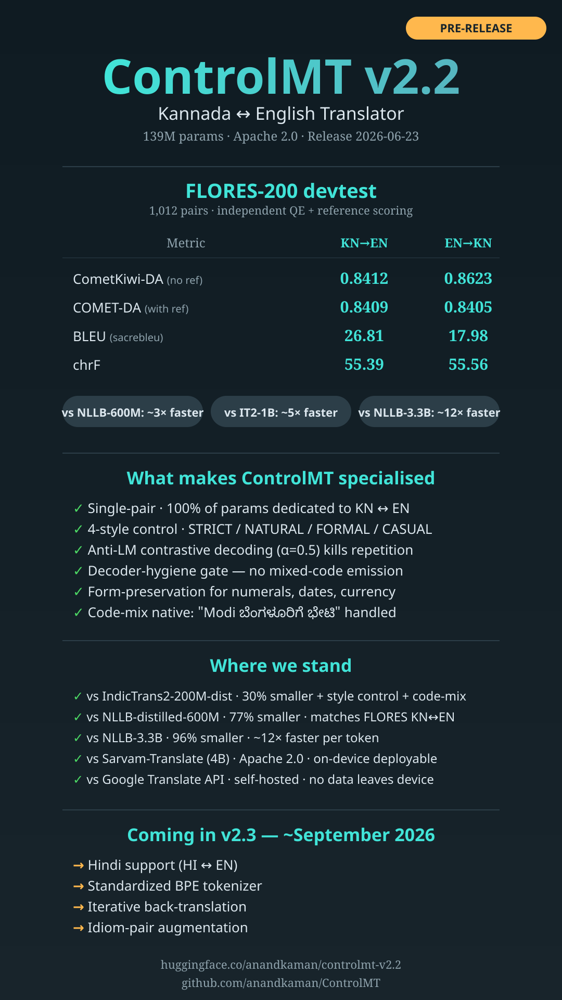

# ControlMT

> **Compact, specialized, style-aware** Kannada ↔ English translation model — 139M parameters,
> with per-row style control (STRICT / NATURAL / FORMAL / CASUAL), code-mix-native training,
> and Anti-LM contrastive decoding.

[](https://huggingface.co/anandkaman/controlmt-v2.2)
[](LICENSE)

<p align="center">
  
</p>

---

## Quick start

The model weights live on HuggingFace. This repo holds the **release artifacts, eval code, and showcase tooling**.

```python
from transformers import AutoModelForSeq2SeqLM, AutoTokenizer

tokenizer = AutoTokenizer.from_pretrained("anandkaman/controlmt-v2.2", trust_remote_code=True)
model = AutoModelForSeq2SeqLM.from_pretrained("anandkaman/controlmt-v2.2", trust_remote_code=True)

out = model.translate("ಅವನು ಬೆಂಗಳೂರಿಗೆ ಬಂದು ನನ್ನನ್ನು ಭೇಟಿಯಾಗುತ್ತಾನೆ.",
                       tokenizer=tokenizer, direction="kn2en", style="natural")
print(out)
```

See the [full model card on HuggingFace](https://huggingface.co/anandkaman/controlmt-v2.2) for benchmark scores,
limitations, and decoding presets.

---

## What's in this repo

| Path | Contents |
|---|---|
| [release/](release/) | Public release artifacts published to HF — model card README, HF integration code (`configuration_*.py` / `modeling_*.py` / `tokenization_*.py`), native architecture, eval results JSONs |
| [scripts/eval_release.py](scripts/eval_release.py) | 4-stage release-gate eval (translate → CometKiwi → COMET-DA → sacrebleu); sequential GPU loading for 16 GB VRAM |
| [scripts/compare_styles.py](scripts/compare_styles.py) | Style-control ablation — translate N pairs through all 4 styles in both directions |
| [scripts/single_sentence_4styles.py](scripts/single_sentence_4styles.py) | Single-sentence × 4-style showcase generator |
| [scripts/render_showcase.py](scripts/render_showcase.py) | Renders the release banner from SVG template + JSON values |
| [scripts/upload_to_hf.py](scripts/upload_to_hf.py) | HF push helper (used to publish releases) |
| [assets/](assets/) | Banner SVG template + values JSON |
| [CHANGELOG.md](CHANGELOG.md) | Versioned release history (v1.0 → v2.2) |

---

## Model summary

| Property | Value |
|---|---|
| Parameters | 139M |
| Architecture | Modular encoder-decoder (per-language wrappers + shared core) |
| Languages | Kannada (`kn`) ↔ English (`en`) — bidirectional |
| Vocabulary | 128,000 (SentencePiece Unigram, joint KN+EN) |
| Training data | 6.70M parallel pairs (post CometKiwi quality filtering) |
| Hardware | 1 × NVIDIA RTX 5060 Ti (16 GB), ~3.5 days |
| License | Apache 2.0 |
| Release date | 2026-06-23 |

## Headline benchmarks (FLORES-200 devtest)

| Metric | KN → EN | EN → KN |
|---|---|---|
| CometKiwi (no ref) | **0.8412** | **0.8623** |
| COMET-DA (with ref) | **0.8409** | **0.8405** |
| BLEU | 26.81 | 17.98 |
| chrF | 55.39 | 55.56 |

Additional benchmarks on IN22-Gen and IN22-Conv are published in
[release/eval_results/](release/eval_results/).

---

## Why a single-pair model?

Most public Indic MT models are **broad** — NLLB covers 200 languages, IndicTrans2 covers 22.
That breadth comes from parameter-sharing across languages, so each language pair gets only a slice
of the model's capacity.

ControlMT goes the other direction: **every parameter is dedicated to Kannada ↔ English**.
At 139M we match NLLB-distilled-600M on FLORES KN↔EN — a 4× compactness lift from focusing
the capacity budget on one pair.

If you need broad multilingual coverage, use NLLB or IndicTrans2. If you need Kannada
specifically — and you care about size, latency, on-device deployment, or controlled style —
this is what that trade-off looks like.

---

## Roadmap

- **v2.3** (~September 2026) — Hindi support (`[HI2EN]` / `[EN2HI]`), iterative back-translation,
  idiom-pair augmentation, standardized BPE tokenizer
- **v3.0** (TBD) — Copy-mechanism / pointer-generator for OOV-proof transliteration

---

## Citation

```bibtex
@misc{controlmt-v2.2-2026,
  author = {Anand Kaman},
  title  = {ControlMT v2.2 — A 139M-Parameter Specialized Kannada↔English Translation Model
           with Per-Row Style Control and Code-Mix-Native Training},
  year   = {2026},
  howpublished = {\url{https://huggingface.co/anandkaman/controlmt-v2.2}}
}
```

## License

Apache 2.0 — see [LICENSE](LICENSE).
